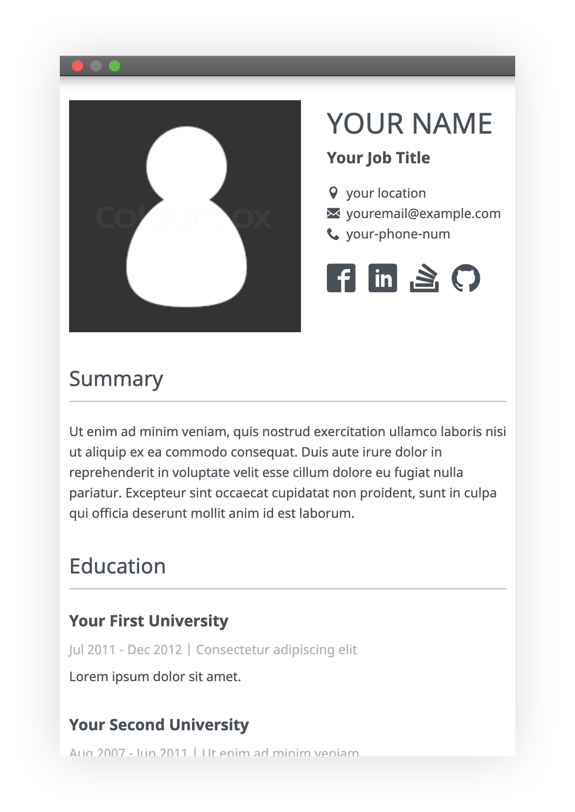

# Minimal Resume Theme

<p align="center">
  
  
</p>

## Introduction

This is a responsive minimal résumé template made by [Daniel Karski](https://github.com/dkarski/minimal-resume-theme/), powered by [Gatsby.js](https://www.gatsbyjs.org/).

You may config all the data in `json` and make it your own résumé. Then, you might use on GitHub Pages, your website, or wherever you want.

[DEMO](https://dkarski.github.io/minimal-resume-theme/)

## Features

* Simple, elegant, and minimal design
* PC and mobile friendly, but it looks better on PC
* PDF supports and print friendly
* Flexible and extensible

## Usage

### Local Mode

1. Clone the repo

    ```shell
    git clone https://dkarski.github.io/minimal-resume-theme/
    ```

2. Install Jekyll

    ```shell
    npm install
    ```

3. Config your résumé data

    The `homepage` is required in `package.json` if you serve this page on GitHub Pages. And your contact information, __EDUCATION__, __SKILLS__, __EXPERIENCE__, and __PROJECTS__ data will be set in `src/data/resume.json`.

4. Run and Debug

    ```shell
    npm start
    ```

5. Build

    ```shell
    npm build
    ```
    
    :warning: before build make sure that `https://dkarski.github.io/minimal-resume-theme/` is replaced in the whole project to correct address

6. Deploy on GitHub Pages

    ```shell
    npm deploy
    ```
    
## Extending Sections

1. Add new section in `src/data/resume.json`

  ```json
  {
    "summary": "Ut enim ad minim veniam, quis nostrud exercitation ullamco laboris nisi ut aliquip ex ea commodo consequat.",
  }
  ```

2. Add section to `src/App.js`:


  ```jsx
  import React from 'react';
  
  const Summary = ({ summary }) => {
    const {
      dataJson: { summary },
    } = useStaticQuery(query)
    
    return (
      <div>
        <h1>Summary</h1>
        <p>{summary}</p>
      </div>
    );
  };
  
  export default Summary
  
  export const query = graphql`
    query {
      dataJson {
        summary
      }
    }
  `

  ```
  
  ```jsx
  import React from 'react';
  
  const App = () => {
    return (
      <Summary />
    );
  }
  ```

## Showcases

Feel free to add yours here.

* [Daniel Karski](https://danielkarski.pl/)

## Donation

* [Buy Me A Coffee](https://www.buymeacoffee.com/7eRzBIy)
* [PayPal](https://www.paypal.me/dkarski)

## License

[](https://opensource.org/licenses/MIT)
